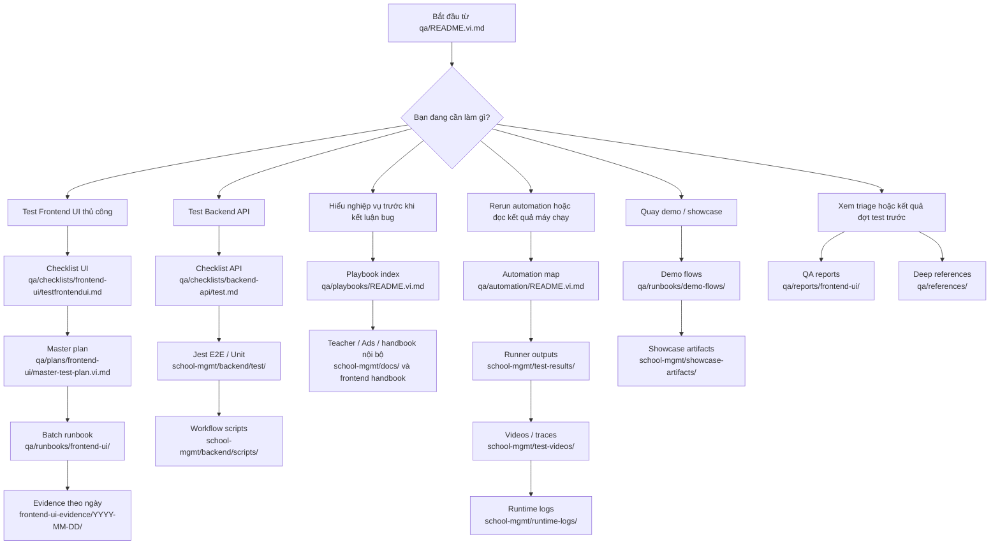

# Sơ Đồ Sử Dụng QA

Tài liệu này là bản đồ 1 trang để QA biết cần mở thư mục nào theo đúng mục tiêu.

## Sơ đồ tổng quan

## Đi nhanh theo nhu cầu

- Muốn biết phải test cái gì ở UI: mở `qa/checklists/frontend-ui/testfrontendui.md`
- Muốn biết test theo luật nào: mở `qa/plans/frontend-ui/master-test-plan.vi.md`
- Muốn chạy theo batch và quay bằng chứng: mở `qa/runbooks/frontend-ui/`
- Muốn hiểu vì sao màn hình đang trống hay bị chặn: mở `qa/playbooks/README.vi.md`
- Muốn test API/backend: mở `qa/checklists/backend-api/test.md`, rồi đối chiếu `school-mgmt/backend/test/` và `school-mgmt/backend/scripts/`
- Muốn xem kết quả máy chạy chính thức: mở `school-mgmt/test-results/`, `school-mgmt/test-videos/`, `school-mgmt/runtime-logs/`
- Muốn quay demo cho stakeholder: mở `qa/runbooks/demo-flows/`
- Muốn xem bằng chứng manual UI đã chốt: mở `frontend-ui-evidence/<YYYY-MM-DD>/`

## Không dùng nhầm

- `qa/runbooks/demo-flows/` là để kể câu chuyện demo, không thay cho sign-off checklist.
- `school-mgmt/test-results/` và `school-mgmt/test-videos/` là output automation, không thay cho evidence manual UI.
- `runtime-logs/` và `school-mgmt/runtime-logs/` là log kỹ thuật, không phải bằng chứng PASS.
- `school-mgmt/docs/` là source of truth cho tài liệu sản phẩm và SOP; `qa/` mới là hub điều hành kiểm thử.

## Canonical paths

- QA hub: `qa/README.vi.md`
- Manual UI evidence: `frontend-ui-evidence/`
- Automation results: `school-mgmt/test-results/`
- Automation videos/traces: `school-mgmt/test-videos/`
- App runtime logs: `school-mgmt/runtime-logs/`
