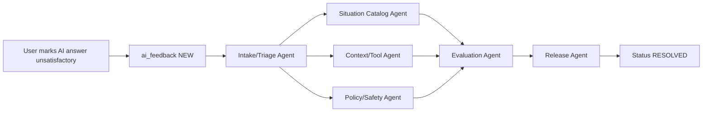

# AI Feedback Improvement Loop

Tai lieu nay mo ta cach ghi nhan hoi thoai AI chua thoa dang va chia sub-agent de nang cap he thong ERP AI.

## Muc tieu

- Luu rieng danh sach cau hoi/cau tra loi AI chua thoa dang vao collection `ai_feedback`.
- Giu du bang chung de Codex/sub-agent sua dung diem yeu: cau hoi goc, cau tra loi AI, assistant type, context/tool keys, ly do va muc do nghiem trong.
- Khong bien audit log thanh backlog san pham. Audit log chi ghi su kien tao/cap nhat feedback.

## API

### Doc conversation corpus

`GET /ai/conversation-corpus?assistantType=OPS_OPERATIONS&limit=30`

Chi `DIRECTOR` va `OPS` doc duoc. Endpoint nay lay cap hoi-dap da luu trong `AiSession/AiMessage`, kem `situationKey`, `toolKeys`, `source`, `activeRoute` va facets. Dung endpoint nay de tim mau hoi thoai lap lai, sau do tao feedback/eval cho nhung cau tra loi can sua. Khong nap raw corpus vao prompt mac dinh.

### Tao feedback

`POST /ai-feedback`

Tat ca user co quyen dung AI co the gui feedback.

```json
{
  "source": "DIRECTOR_AI",
  "assistantType": "DIRECTOR_OPERATIONS",
  "sessionId": "665000000000000000000001",
  "messageId": "665000000000000000000002",
  "activeRoute": "/app/dashboard",
  "userMessage": "Hom nay can xu ly gi?",
  "assistantAnswer": "Chua the goi AI API...",
  "category": "MISSING_CONTEXT",
  "severity": "MEDIUM",
  "reason": "Tra loi chua neu viec can lam theo thu tu uu tien",
  "contextKeys": ["daily_tasks", "pending_approvals_summary"],
  "toolKeys": []
}
```

Neu cung user gui lai feedback cho cung `source + messageId`, backend merge vao ban ghi cu va dua status ve `NEW` de tranh spam.

### Doc backlog

`GET /ai-feedback?status=NEW&source=DIRECTOR_AI&limit=30`

Chi `DIRECTOR` va `OPS` duoc doc backlog. Co the loc theo `status`, `source`, `assistantType`, `category`, `severity`, `userRole`, `fromDate`, `toDate`, `search`.

### Cap nhat trang thai

`PATCH /ai-feedback/:id/status`

```json
{
  "status": "PLANNED",
  "resolutionNotes": "Can them tinh huong uu tien viec dau ngay va eval regression"
}
```

Trang thai:

- `NEW`: moi duoc nguoi dung bao cao.
- `REVIEWED`: da doc va phan loai nguyen nhan.
- `PLANNED`: da co viec nang cap prompt/router/tool/eval.
- `RESOLVED`: da sua va verify.
- `DISMISSED`: khong can xu ly.

## Luong xu ly sub-agent



### 1. Intake/Triage Agent

- Doc feedback `NEW`, gom theo `source`, `assistantType`, `category`, `contextKeys`.
- Xac dinh loi thuoc nhom nao: sai du lieu, thieu context, router sai tinh huong, hanh dong ghi rui ro, giong dieu, fallback/token, hay UI kho dung.
- Cap status `REVIEWED` kem `resolutionNotes` ngan gon.

### 2. Situation Catalog Agent

- Cap nhat situation/router neu cau hoi bi map sai y dinh.
- Bo sung example question, trigger keyword va response guidance.
- Them regression case tu cau hoi that cua user.

### 3. Context/Tool Agent

- Kiem tra context/tool keys da nap co du de tra loi khong.
- Neu thieu, them tool doc du lieu ERP hoac drill-down theo entity.
- Kiem tra gioi han compact context de tranh cat mat truong quan trong.

### 4. Policy/Safety Agent

- Kiem tra RBAC, data boundary va write policy.
- Cac feedback `UNSAFE`, `BAD_ACTION`, `CRITICAL` phai duoc xu ly truoc.
- Dam bao AI khong noi da duyet/da gui/da sua neu moi la de xuat hoac draft can xac nhan.

### 5. Evaluation Agent

- Chuyen feedback da triage thanh eval case.
- Kiem tra cau tra loi moi co: ket luan, so lieu/chung cu, rui ro, viec tiep theo.
- Them test cho router, policy hoac response guard neu loi co the lap lai.

### 6. UI Agent

- Nang cap diem thu feedback tren cac tro ly user khac: Director, Accounting, OPS, Teacher, Sale, Parent, Student.
- Dam bao form feedback khong can nguoi dung nhap lai context va co the gui nhanh.

### 7. Release Agent

- Chay build/test lien quan.
- Cap status `RESOLVED` khi fix da vao code va co bang chung verify.
- Cap status `DISMISSED` neu feedback khong hop le, trung lap khong can xu ly, hoac ngoai pham vi.

## Nguyen tac bao mat

- Chi luu doan hoi thoai can thiet, backend gioi han `userMessage`, `assistantAnswer`, `reason`.
- Khong luu token, prompt noi bo, secret, raw database dump.
- Backlog feedback la du lieu noi bo; endpoint doc chi mo cho `DIRECTOR` va `OPS`.
