# Hướng Dẫn Sử Dụng Chi Tiết Dành Cho Giáo Viên

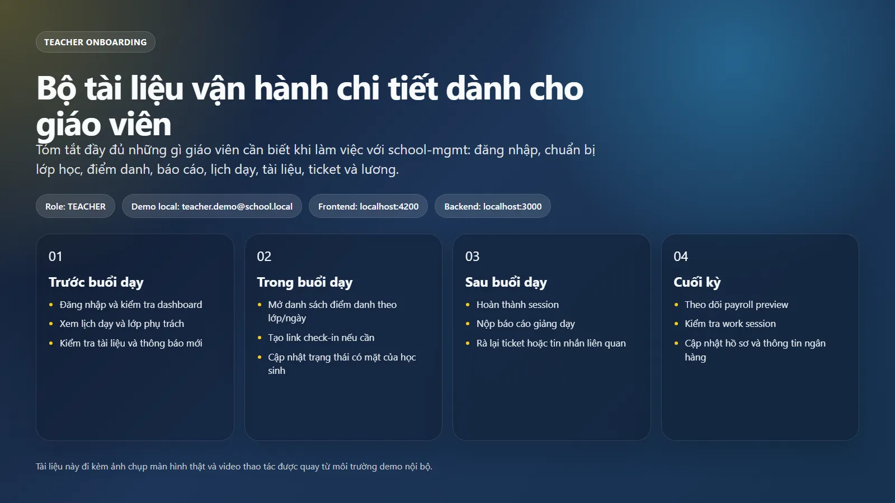

## 1. Mục tiêu tài liệu

Tài liệu này dùng cho vai trò `TEACHER` trong hệ thống `school-mgmt`, bám theo đúng route frontend, quyền backend và dữ liệu demo đang có trong workspace hiện tại.

Mục tiêu:

1. Hướng dẫn giáo viên đăng nhập và vận hành toàn bộ chức năng được cấp quyền.
2. Chuẩn hóa các việc cần làm theo ngày, theo buổi dạy, theo tuần và theo tháng.
3. Làm tài liệu onboarding, SOP vận hành và tài liệu quay demo/đào tạo nội bộ.

## 2. Phạm vi vai trò giáo viên

### 2.1. Menu giáo viên đang có trong hệ thống

Theo UI hiện tại, giáo viên nhìn thấy các nhóm chức năng sau:

1. `Tổng quan`
   - `Dashboard`
   - `Thông báo`
2. `Quản lý`
   - `Quản lý Lớp học`
3. `Giảng dạy`
   - `Buổi học`
   - `Điểm danh`
   - `Tài liệu GD`
   - `BC Giảng dạy`
   - `Hồ sơ cá nhân`
   - `Lịch dạy`
   - `Xin nghỉ/Thay thế`
4. `Tài chính`
   - `Lương GV (session)`
   - `Chấm công`
5. `Báo cáo`
   - `BC Điểm danh`
6. `Hệ thống`
   - `Hỗ trợ & Ticket`
   - `Tin nhắn`

### 2.2. Những gì giáo viên làm được

1. Đăng nhập, duy trì phiên và đăng xuất.
2. Xem dashboard cá nhân: buổi học, lớp đang dạy, ticket, thu nhập.
3. Xem lớp mình phụ trách.
4. Xem buổi học của mình, hoàn thành buổi dạy, hủy buổi trong phạm vi cho phép.
5. Điểm danh học sinh theo lớp/ngày, tạo link điểm danh cho học sinh.
6. Nộp và theo dõi báo cáo giảng dạy.
7. Xem preview lương và bảng lương của chính mình.
8. Xem và cập nhật hồ sơ giảng dạy cá nhân.
9. Xem lịch dạy tuần/tháng.
10. Tạo yêu cầu xin nghỉ/nhờ giáo viên thay thế.
11. Tải lên, chỉnh sửa, xóa tài liệu giảng dạy của mình.
12. Xem chấm công cá nhân.
13. Tạo ticket hỗ trợ, phản hồi ticket, nhắn tin nội bộ.

### 2.3. Những gì giáo viên không làm được

1. Không tạo/sửa/xóa lớp học.
2. Không tạo buổi học mới hàng loạt hay điều phối buổi học như OPS/DIRECTOR.
3. Không duyệt payroll, không đánh dấu chi lương, không chốt payroll.
4. Không truy cập các màn hình quản trị người dùng, sản phẩm, hóa đơn, ví, tài chính, ads, audit log.

## 3. Điều kiện trước khi sử dụng

### 3.1. Truy cập hệ thống

1. Frontend local: `http://localhost:4200`
2. Backend local: `http://localhost:3000`

### 3.2. Tài khoản demo đã xác minh trong local workspace

1. Email demo giáo viên: `teacher.demo@school.local`
2. Mật khẩu demo hiện hành lấy theo biến `DEMO_PASSWORD` trong file `school-mgmt/.env`
3. Trong dữ liệu local hiện tại, giáo viên demo đang phụ trách lớp `DEMO-MIX - Toán Tiếng Anh Demo`

### 3.3. Lưu ý kỹ thuật quan trọng

1. Đăng nhập sử dụng cookie `httpOnly`, không phải token dán tay ở frontend.
2. Khi đăng nhập thành công, hệ thống backend có ghi nhận `work session` đăng nhập.
3. Khi đăng xuất, backend ghi nhận `work session` đăng xuất.
4. Báo cáo giảng dạy ảnh hưởng trực tiếp đến điều kiện tính lương.
5. Điểm danh và link điểm danh học sinh là một phần của luồng buổi học và có liên quan đến dữ liệu attendance/session/payroll.

## 4. Việc Cần Làm Của Giáo Viên

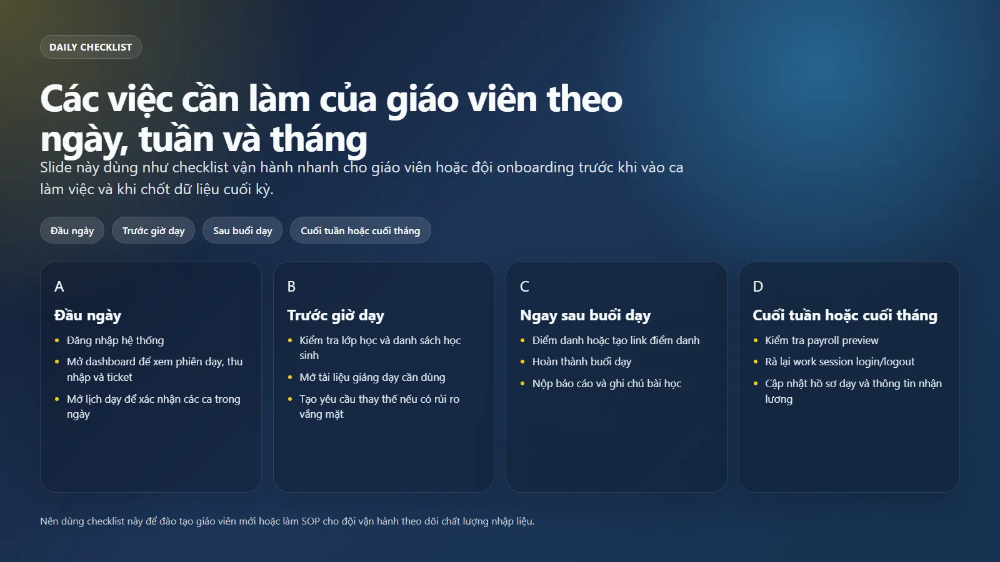

### 4.1. Việc cần làm đầu ngày

1. Đăng nhập hệ thống.
2. Mở `Dashboard` để xem:
   - tổng số buổi đang có
   - thu nhập đã ghi nhận
   - khoản chờ thanh toán
   - số lớp đang dạy
   - ticket đang mở
3. Mở `Lịch dạy` để xem hôm nay có buổi nào.
4. Mở `Buổi học` để kiểm tra trạng thái các buổi gần nhất:
   - `SCHEDULED`
   - `TEACHER_COMPLETED`
   - `FINALIZED`
5. Mở `Thông báo` để xem có việc cần xử lý hay không.

### 4.2. Việc cần làm trước giờ dạy

1. Mở `Quản lý Lớp học` để kiểm tra lớp và danh sách học sinh.
2. Mở `Tài liệu GD` để chắc chắn tài liệu cần dùng đã có.
3. Nếu cần dời lịch hoặc có nguy cơ vắng mặt:
   - tạo `Xin nghỉ/Thay thế`
   - hoặc tạo `Ticket` hỗ trợ nếu cần OPS xử lý gấp
4. Nếu muốn để học sinh tự check-in:
   - vào `Điểm danh`
   - chọn lớp và ngày
   - tạo `link điểm danh` cho học sinh

### 4.3. Việc cần làm trong và ngay sau buổi dạy

1. Vào `Điểm danh`, chọn lớp và ngày.
2. Ghi nhận học sinh có mặt.
3. Nếu dùng self check-in thì tạo link cho từng học sinh cần dùng.
4. Sau buổi dạy, vào `Buổi học` để:
   - mở chi tiết buổi
   - bấm `Hoàn thành`
   - nhập nội dung dạy, bài tập về nhà, ghi chú giáo viên
5. Vào `BC Giảng dạy` để nộp/kiểm tra báo cáo cho các buổi cần báo cáo.

### 4.4. Việc cần làm cuối ngày

1. Kiểm tra lại `Buổi học` xem còn buổi `SCHEDULED` nào chưa xử lý.
2. Kiểm tra `BC Giảng dạy` xem còn mục `Chưa có báo cáo` hay không.
3. Kiểm tra `Ticket` và `Tin nhắn` nếu đang có trao đổi mở.
4. Đăng xuất để hệ thống ghi nhận giờ kết thúc làm việc.

### 4.5. Việc cần làm cuối tuần/cuối tháng

1. Mở `Lương GV (session)` để kiểm tra:
   - buổi đã thanh toán
   - buổi chờ phụ huynh xác nhận
   - buổi chờ OPS chốt
   - buổi thiếu báo cáo
2. Mở `Chấm công` để rà soát lịch sử đăng nhập/đăng xuất.
3. Mở `Hồ sơ cá nhân` để cập nhật:
   - môn dạy
   - khối lớp
   - lịch rảnh
   - thông tin ngân hàng
4. Mở `BC Điểm danh` để xem tổng hợp attendance theo thời gian/lớp.

## 5. Hướng Dẫn Chi Tiết Theo Chức Năng

### 5.1. Đăng nhập

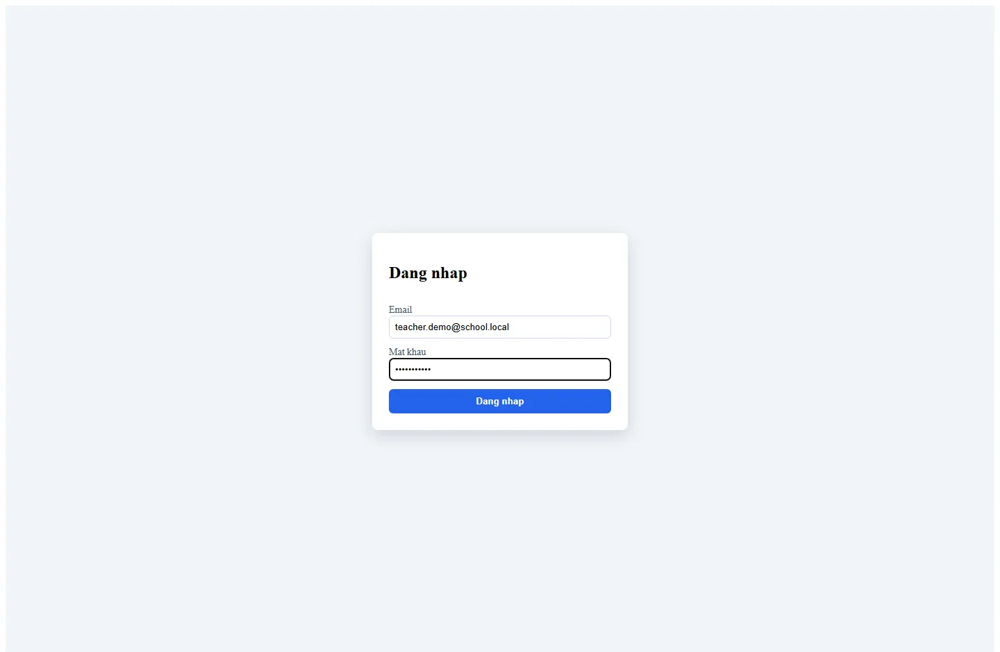

Mục tiêu:

1. Truy cập vào khu vực làm việc của giáo viên.

Các bước:

1. Truy cập `http://localhost:4200/login`
2. Nhập `Email`
3. Nhập `Mật khẩu`
4. Bấm `Đăng nhập`
5. Sau khi thành công, hệ thống chuyển sang `Dashboard`

Kết quả mong đợi:

1. Sidebar hiện menu đúng của giáo viên.
2. Thông tin góc trái dưới hiển thị tên và role của giáo viên.
3. Không nhìn thấy các module admin không thuộc quyền.

Lưu ý:

1. Sai mật khẩu sẽ hiện lỗi `Đăng nhập thất bại` hoặc thông báo tương đương.
2. Đăng nhập sai quá nhiều lần có thể bị lock theo cơ chế backend.

### 5.2. Dashboard Giáo Viên

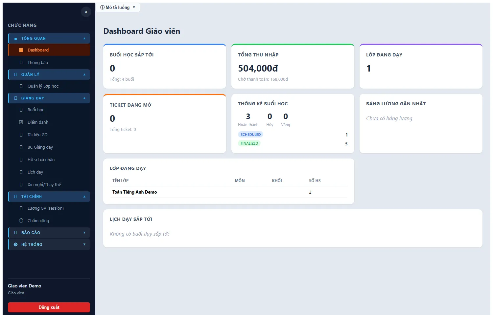

Mục tiêu:

1. Xem nhanh toàn bộ trạng thái công việc hiện tại.

Dữ liệu chính:

1. `Buổi học sắp tới`
2. `Tổng thu nhập`
3. `Chờ thanh toán`
4. `Lớp đang dạy`
5. `Ticket đang mở`
6. Hồ sơ giảng dạy tóm tắt
7. Bảng lương gần nhất
8. Lịch dạy sắp tới

Giá trị sử dụng:

1. Đầu ngày chỉ cần nhìn Dashboard là biết còn việc gì chưa khép.
2. Nếu `Chờ thanh toán` tăng mà `Đã nhận lương` không tăng, cần rà lại payroll/report/finalize.

### 5.3. Quản lý Lớp học

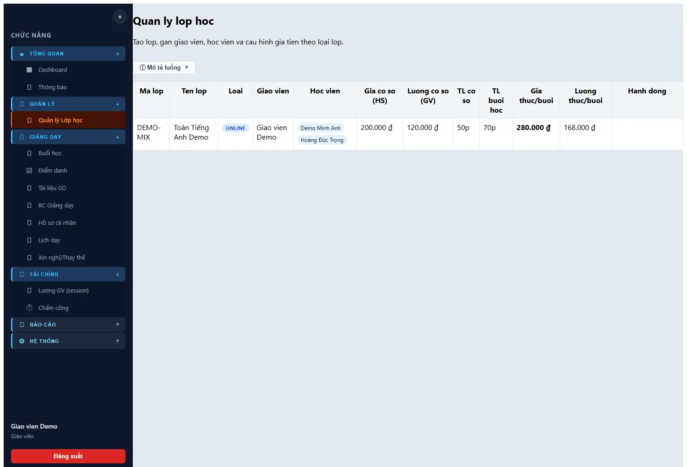

Mục tiêu:

1. Xem lớp mình đang dạy và các thông tin tài chính liên quan tới buổi học.

Giáo viên dùng màn hình này để:

1. Xem `mã lớp`, `tên lớp`, `giá cơ sở`, `lương cơ sở`, `thời lượng`
2. Xem danh sách học sinh trong lớp
3. Xem giáo viên/sale gắn với lớp

Lưu ý:

1. Với role giáo viên, đây là màn hình xem thông tin, không phải màn hình quản trị lớp.
2. Nút tạo/sửa/xóa lớp chỉ dành cho role quản lý tương ứng.

### 5.4. Buổi học

Mục tiêu:

1. Theo dõi từng buổi đã lên lịch và thao tác sau buổi dạy.

Giáo viên có thể:

1. Xem danh sách buổi học của chính mình
2. Lọc theo lớp, trạng thái, ngày bắt đầu, ngày kết thúc
3. Mở chi tiết buổi học
4. `Hoàn thành` buổi học đang ở trạng thái `SCHEDULED`
5. `Hủy` buổi học trong phạm vi được backend cho phép
6. Đánh dấu `no-show` trong luồng hỗ trợ nếu nghiệp vụ cần

Khi bấm `Hoàn thành`, giáo viên nhập:

1. `Nội dung đã dạy`
2. `Bài tập về nhà`
3. `Ghi chú`

Kết quả mong đợi:

1. Buổi học chuyển sang trạng thái do backend quy định.
2. Dữ liệu buổi học là nguồn quan trọng để payroll và teaching report đối chiếu.

### 5.5. Điểm danh

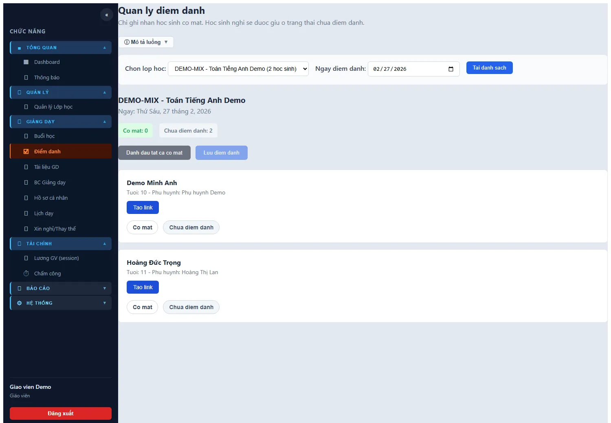

Mục tiêu:

1. Ghi nhận học sinh có mặt theo lớp và ngày.
2. Tạo link điểm danh cho học sinh tự check-in.

Các bước thao tác chuẩn:

1. Vào `Điểm danh`
2. Chọn `Lớp học`
3. Chọn `Ngày điểm danh`
4. Bấm `Tải danh sách`
5. Với từng học sinh:
   - bấm `Có mặt` nếu đi học
   - để `Chưa điểm danh` nếu chưa xác nhận
6. Bấm `Lưu điểm danh`

Tạo link điểm danh:

1. Sau khi tải danh sách học sinh, bấm `Tạo link`
2. Hệ thống sinh URL dạng `/student-attendance/:token`
3. Link có thời hạn sử dụng
4. Có thể copy gửi cho học sinh/phụ huynh

Lưu ý vận hành:

1. Đây là màn hình giáo viên nên chỉ nên thao tác trên lớp của mình.
2. Nếu dùng link điểm danh, cần xác nhận đúng học sinh và đúng ngày.
3. Điểm danh có liên quan đến session bridge và có thể ảnh hưởng đến tính lương theo session/attendance.

### 5.6. Báo cáo Điểm danh

Mục tiêu:

1. Xem tổng hợp attendance có ảnh chụp/check-in theo lớp và khoảng ngày.

Giáo viên có thể:

1. Lọc theo `Từ ngày`
2. Lọc theo `Đến ngày`
3. Lọc theo `Lớp học`
4. Xem:
   - ngày
   - thời gian điểm danh
   - học sinh
   - giáo viên
   - ảnh học sinh
   - ảnh điểm danh
   - ghi chú

Phù hợp khi:

1. Cần đối soát lại việc đi học.
2. Cần giải thích với OPS/phụ huynh về ảnh check-in thực tế.

### 5.7. Báo cáo Giảng dạy

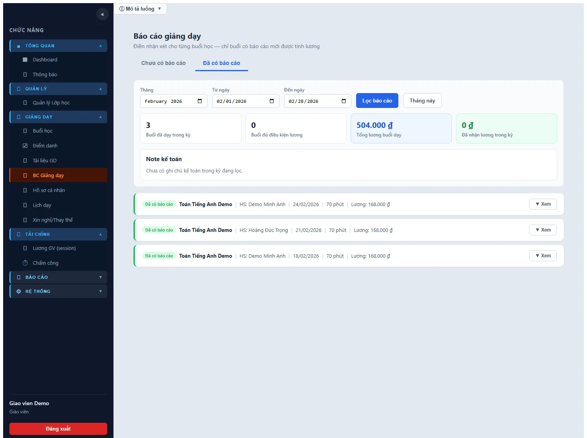

Mục tiêu:

1. Theo dõi các buổi đã có/chưa có báo cáo.
2. Bảo đảm buổi học đủ điều kiện tính lương.

Tabs hiện có:

1. `Chưa có báo cáo`
2. `Đã có báo cáo`

Bộ lọc:

1. `Tháng`
2. `Từ ngày`
3. `Đến ngày`
4. `Lọc báo cáo`
5. `Tháng này`

Thông tin quan trọng:

1. `Buổi đã dạy trong kỳ`
2. `Buổi đủ điều kiện lương`
3. `Tổng lương buổi dạy`
4. `Đã nhận lương trong kỳ`
5. `Note kế toán`

Lưu ý nghiệp vụ rất quan trọng:

1. Chỉ các buổi có báo cáo mới đi đúng luồng payroll.
2. Nếu thiếu báo cáo, payroll preview sẽ chặn buổi đó hoặc báo trạng thái chờ tương ứng.

### 5.8. Hồ sơ cá nhân / Hồ sơ giảng dạy

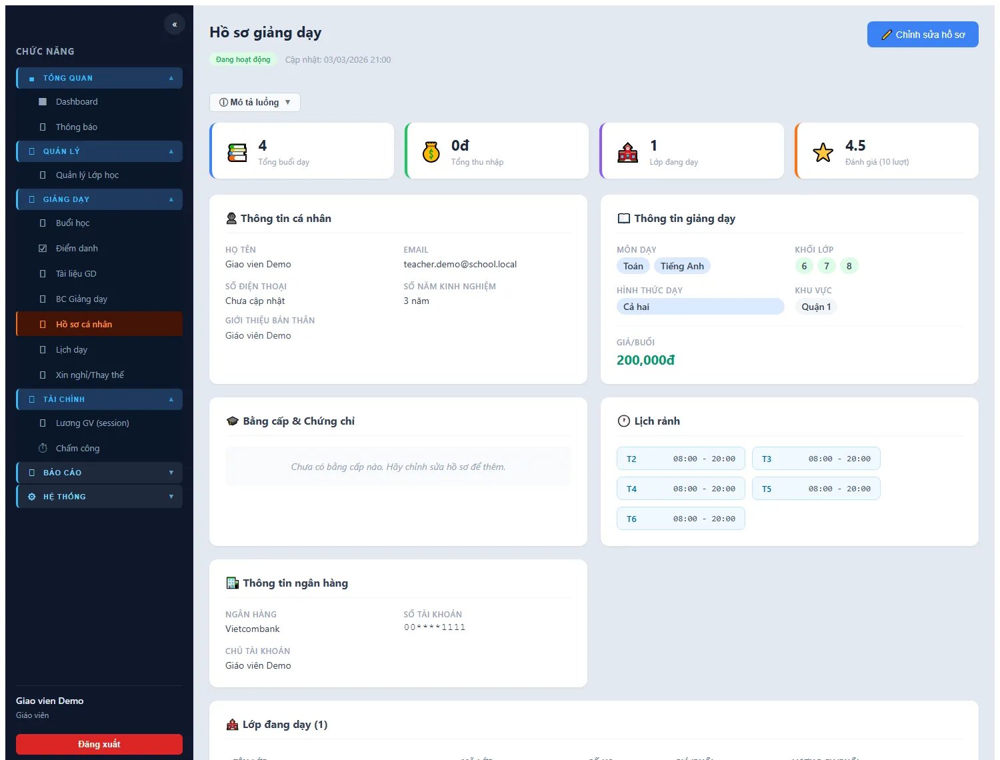

Mục tiêu:

1. Giáo viên tự quản trị hồ sơ nghề nghiệp và thông tin thanh toán.

Thông tin đang quản lý:

1. Thông tin cá nhân
2. Môn dạy
3. Khối lớp
4. Hình thức dạy
5. Khu vực
6. Giá/buổi, giá/giờ
7. Bằng cấp/chứng chỉ
8. Lịch rảnh
9. Thông tin ngân hàng
10. Lớp đang dạy
11. Thống kê buổi học

Khi bấm `Chỉnh sửa hồ sơ`, giáo viên có thể cập nhật:

1. `subjects`
2. `grades`
3. `teachingMode`
4. `locations`
5. `bio`
6. `yearsOfExperience`
7. `videoIntroUrl`
8. `pricePerSession`
9. `pricePerHour`
10. `qualifications`
11. `availability`
12. `bankInfo`

Lưu ý:

1. Đây là dữ liệu nền để quản lý nhìn năng lực và để lương/thông tin chuyển khoản không sai.
2. Cần đặc biệt giữ đúng số tài khoản và tên chủ tài khoản.

### 5.9. Lịch dạy

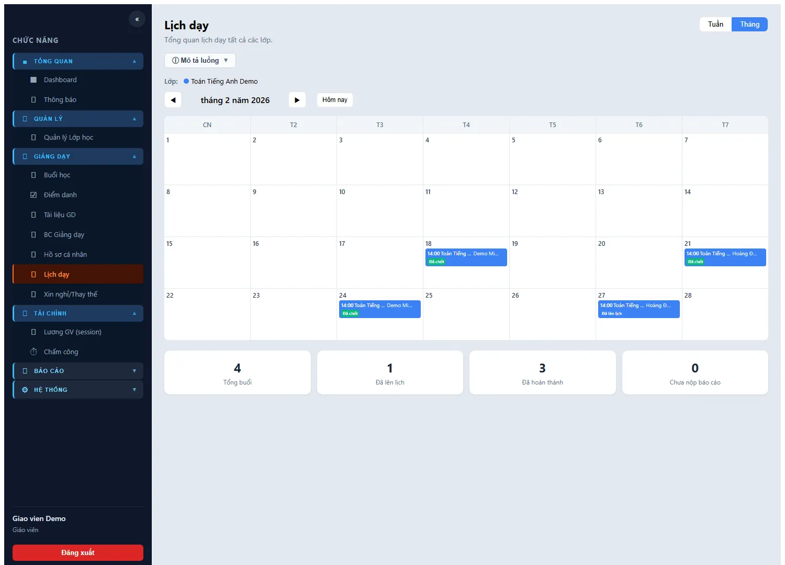

Mục tiêu:

1. Xem toàn bộ lịch dạy cá nhân ở dạng `Tuần` và `Tháng`.

Các thao tác:

1. Chuyển `Tuần` / `Tháng`
2. Dùng `◀`, `▶`, `Hôm nay` để đổi mốc thời gian
3. Click vào buổi học để xem:
   - học sinh
   - lớp
   - thời lượng
   - loại buổi
   - trạng thái
   - đã nộp báo cáo hay chưa

Trạng thái thường gặp:

1. `SCHEDULED`
2. `TEACHER_COMPLETED`
3. `PARENT_CONFIRMED`
4. `FINALIZED`
5. `CANCELLED`
6. `NO_SHOW`
7. `RESCHEDULED`

### 5.10. Xin nghỉ / Thay thế

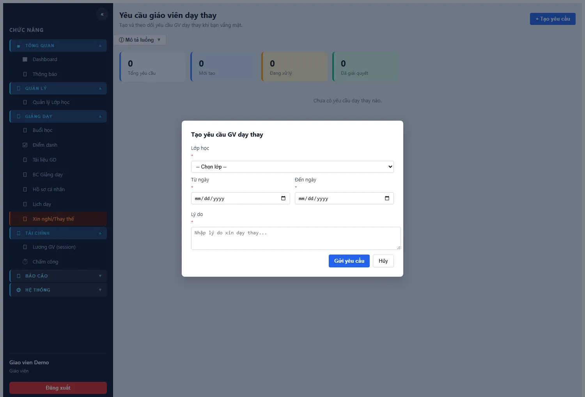

Mục tiêu:

1. Tạo yêu cầu xin nghỉ hoặc nhờ giáo viên dạy thay theo lớp và khoảng ngày.

Các bước:

1. Vào `Xin nghỉ/Thay thế`
2. Bấm `+ Tạo yêu cầu`
3. Chọn `Lớp học`
4. Chọn `Từ ngày`
5. Chọn `Đến ngày`
6. Nhập `Lý do`
7. Bấm `Gửi yêu cầu`

Điều kiện kiểm tra ở UI:

1. Không được bỏ trống lớp/ngày/lý do
2. `Đến ngày` phải lớn hơn hoặc bằng `Từ ngày`

Kết quả:

1. Hệ thống tạo ticket loại `SUBSTITUTE_TEACHER`
2. Giáo viên có thể theo dõi trạng thái xử lý ngay trên màn hình này

### 5.11. Tài liệu giảng dạy

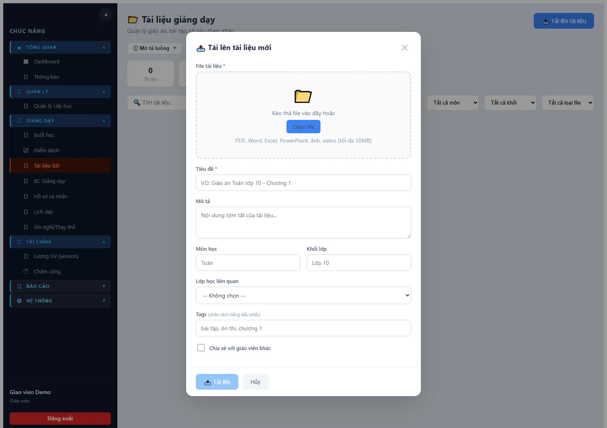

Mục tiêu:

1. Quản lý kho giáo án, bài tập, file tham khảo.

Các thao tác:

1. `Tải lên tài liệu`
2. Tìm kiếm theo từ khóa
3. Lọc theo `Môn`, `Khối`, `Loại file`
4. Tải xuống
5. Chỉnh sửa metadata
6. Xóa tài liệu

Metadata đang hỗ trợ:

1. `title`
2. `description`
3. `subject`
4. `grade`
5. `classId`
6. `tags`
7. `isShared`

Loại file hỗ trợ theo backend:

1. PDF
2. Word
3. Excel
4. PowerPoint
5. JPG/PNG/GIF/WEBP
6. MP4/WEBM
7. ZIP/RAR/7Z
8. TXT/CSV

Giới hạn:

1. Tối đa `50MB` mỗi file

### 5.12. Lương Giáo Viên (session)

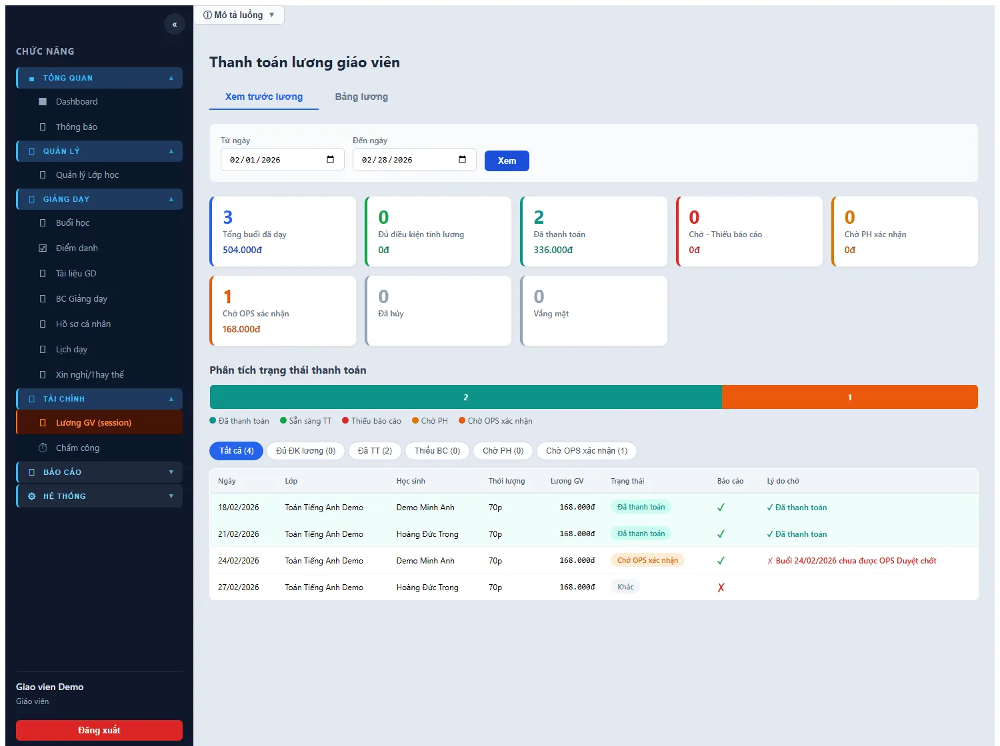

Mục tiêu:

1. Xem trước lương theo khoảng ngày.
2. Xem bảng lương đã được tạo cho chính mình.

Tab `Xem trước lương` cho giáo viên:

1. Chọn `Từ ngày`
2. Chọn `Đến ngày`
3. Bấm `Xem`
4. Hệ thống hiển thị:
   - tổng buổi đã dạy
   - số buổi đủ điều kiện lương
   - buổi đã thanh toán
   - buổi chờ phụ huynh xác nhận
   - buổi chờ OPS xác nhận
   - buổi thiếu báo cáo
   - buổi hủy / no-show

Ý nghĩa rất quan trọng:

1. Nếu buổi bị kẹt ở `Thiếu báo cáo`, giáo viên phải quay lại `BC Giảng dạy`.
2. Nếu buổi ở `Chờ OPS xác nhận`, giáo viên không cần sửa report mà cần OPS finalize.
3. Nếu buổi `Đã thanh toán`, có thể đối soát với bảng lương/tab payroll list.

Tab `Bảng lương`:

1. Giáo viên chỉ xem bảng lương của mình.
2. Có thể mở chi tiết từng payroll và từng item session.
3. Không có quyền duyệt/chi/xóa payroll.

### 5.13. Chấm công

Mục tiêu:

1. Xem lịch sử làm việc cá nhân.

Điểm quan trọng:

1. Backend ghi nhận login khi đăng nhập thành công.
2. Backend ghi nhận logout khi đăng xuất.
3. Giáo viên xem được `ngày`, `giờ vào`, `giờ ra`, `tổng giờ`, `trạng thái`, `đi muộn`.
4. Chỉ role quản trị mới sửa được work session.

### 5.14. Hỗ trợ & Ticket

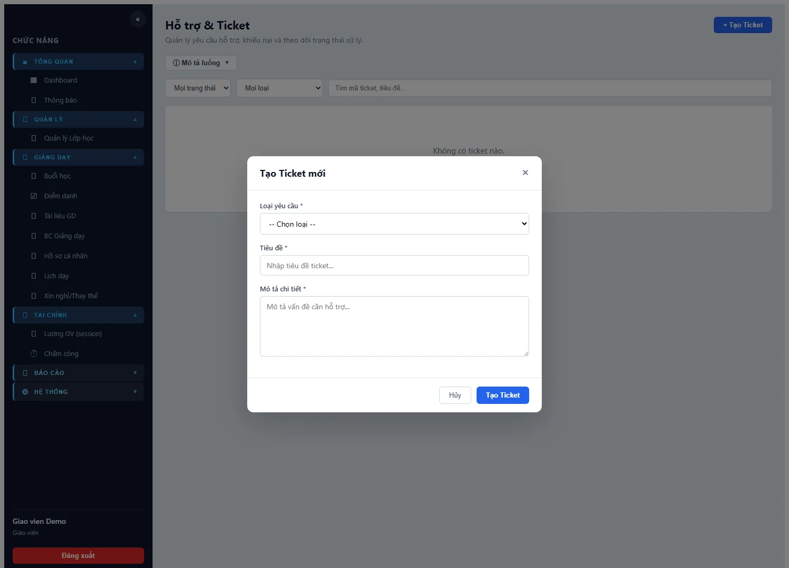

Mục tiêu:

1. Gửi yêu cầu hỗ trợ và theo dõi tiến độ xử lý.

Giáo viên có thể:

1. Tạo ticket mới
2. Chọn loại ticket
3. Chọn mức ưu tiên
4. Mô tả sự cố
5. Xem trạng thái xử lý
6. Xem hội thoại và phản hồi
7. Hủy ticket do mình tạo nếu ticket chưa kết thúc

Tình huống dùng phù hợp:

1. Lỗi phân quyền
2. Sai lịch, sai lớp, sai buổi học
3. Không thấy dữ liệu lương/báo cáo
4. Nhờ OPS hỗ trợ điều phối thay thế

### 5.15. Tin nhắn nội bộ

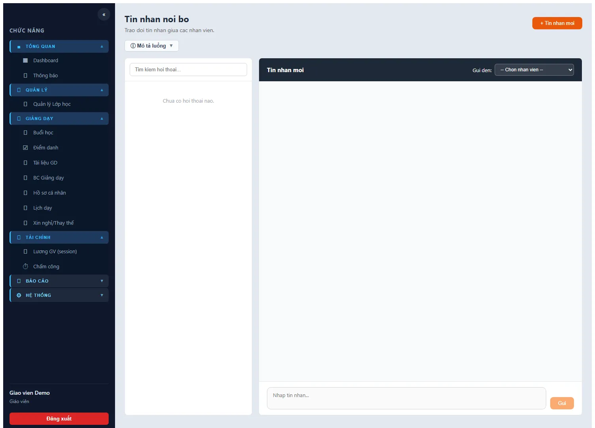

Mục tiêu:

1. Trao đổi nhanh với nhân sự khác trong hệ thống.

Giáo viên có thể:

1. Xem danh sách hội thoại
2. Tìm kiếm hội thoại
3. Tạo tin nhắn mới
4. Chọn người nhận
5. Gửi và nhận tin nhắn
6. Theo dõi unread count

Phù hợp để:

1. Nhắn OPS về lịch dạy
2. Nhắn Accounting về tình trạng payroll
3. Nhắn nội bộ về vấn đề lớp học hoặc tài liệu

### 5.16. Thông báo

Mục tiêu:

1. Nhận sự kiện liên quan đến vai trò giáo viên.

Nên kiểm tra khi:

1. Vừa đăng nhập đầu ngày
2. Sau khi tạo ticket/xin nghỉ/thay thế
3. Khi chờ trạng thái payroll hoặc xử lý từ OPS

### 5.17. Đăng xuất

Các bước:

1. Bấm `Đăng xuất` ở cuối sidebar
2. Hệ thống xóa cookie phiên
3. Backend ghi nhận logout cho `work session`

## 6. Các Kịch Bản Vận Hành Dành Cho Giáo Viên

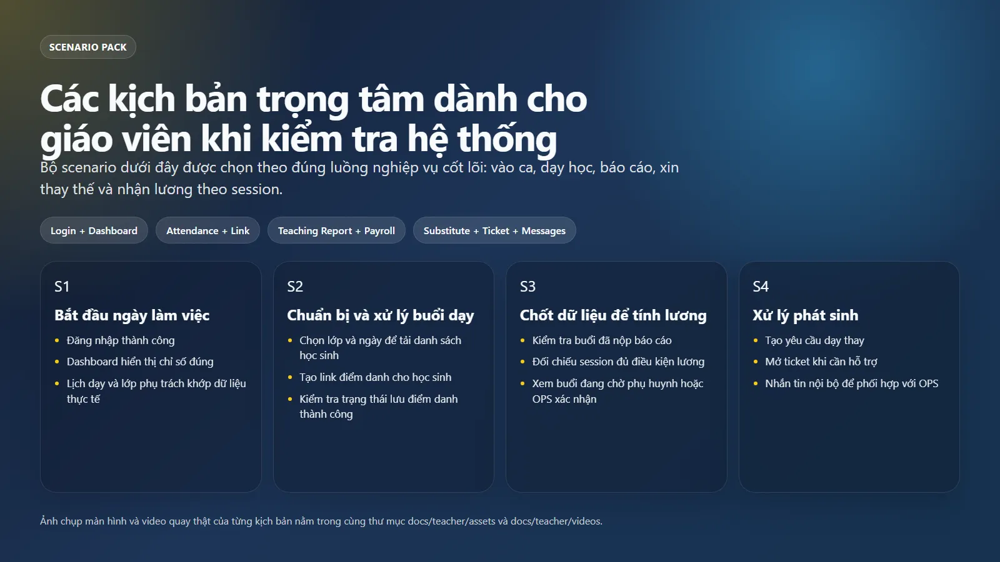

### Kịch bản 1. Bắt đầu ngày làm việc

1. Đăng nhập
2. Mở `Dashboard`
3. Kiểm tra `Lịch dạy`
4. Kiểm tra `Thông báo`
5. Mở `Buổi học` và `Quản lý Lớp học` nếu hôm nay có buổi

### Kịch bản 2. Chuẩn bị buổi dạy

1. Vào `Quản lý Lớp học`
2. Xác nhận đúng lớp, đúng học sinh
3. Mở `Tài liệu GD`
4. Chuẩn bị giáo án
5. Nếu cần self check-in thì mở `Điểm danh` để tạo link

### Kịch bản 3. Điểm danh và hỗ trợ check-in

1. Chọn lớp/ngày ở `Điểm danh`
2. Tải danh sách học sinh
3. Đánh dấu học sinh có mặt
4. Tạo link điểm danh nếu cần
5. Lưu điểm danh

### Kịch bản 4. Hoàn thành buổi dạy

1. Mở `Buổi học`
2. Chọn buổi `SCHEDULED`
3. Bấm `Hoàn thành`
4. Điền nội dung dạy, bài tập, ghi chú
5. Sang `BC Giảng dạy` kiểm tra report đã đủ chưa

### Kịch bản 5. Theo dõi điều kiện tính lương

1. Mở `BC Giảng dạy`
2. Kiểm tra còn buổi nào chưa có báo cáo
3. Mở `Lương GV (session)`
4. Chọn kỳ cần xem
5. Kiểm tra buổi nào:
   - đã thanh toán
   - chờ phụ huynh
   - chờ OPS
   - thiếu báo cáo

### Kịch bản 6. Xin nghỉ hoặc nhờ dạy thay

1. Mở `Xin nghỉ/Thay thế`
2. Tạo yêu cầu
3. Chọn lớp, từ ngày, đến ngày
4. Ghi lý do
5. Theo dõi trạng thái yêu cầu

### Kịch bản 7. Gửi yêu cầu hỗ trợ hoặc nhắn nội bộ

1. Nếu cần quy trình chính thức: tạo `Ticket`
2. Nếu cần trao đổi nhanh: dùng `Tin nhắn`
3. Theo dõi phản hồi ở cả hai nơi

## 7. Gợi Ý Quay Demo / Đào Tạo

### 7.1. Thứ tự quay video nên dùng

1. Video 1: Đăng nhập và xem Dashboard
2. Video 2: Điểm danh lớp, tạo link điểm danh
3. Video 3: Xem báo cáo giảng dạy và preview lương

### 7.2. Bộ asset đã tạo trong repo

Ảnh `.webp`:

1. `./assets/00_teacher_overview.webp`
2. `./assets/01_teacher_daily_checklist.webp`
3. `./assets/02_teacher_scenarios.webp`
4. `./assets/10_teacher_login.webp`
5. `./assets/11_teacher_dashboard.webp`
6. `./assets/12_teacher_classes.webp`
7. `./assets/13_teacher_attendance.webp`
8. `./assets/14_teacher_teaching_report.webp`
9. `./assets/15_teacher_profile.webp`
10. `./assets/16_teacher_calendar.webp`
11. `./assets/17_teacher_substitute.webp`
12. `./assets/18_teacher_materials.webp`
13. `./assets/19_teacher_payroll.webp`
14. `./assets/20_teacher_tickets.webp`
15. `./assets/21_teacher_messages.webp`

Video:

1. `./videos/teacher_login_dashboard.webm`
2. `./videos/teacher_attendance_link.webm`
3. `./videos/teacher_report_payroll.webm`

## 8. Ghi Chú Full Context

1. Hướng dẫn này được viết sau khi rà frontend routes, component, service và backend controller/guard cho vai trò `TEACHER`.
2. Trong workspace hiện tại đã đồng bộ lại quyền backend cho thao tác điểm danh của giáo viên để khớp với UI đang mở route `attendance`.
3. Đã sửa lỗi compile frontend ở `ads.service.ts` để có thể khởi chạy giao diện và quay asset minh họa.
4. Nội dung hình ảnh/video minh họa được ghi trực tiếp từ môi trường local hiện tại tại thời điểm `2026-03-17`.
